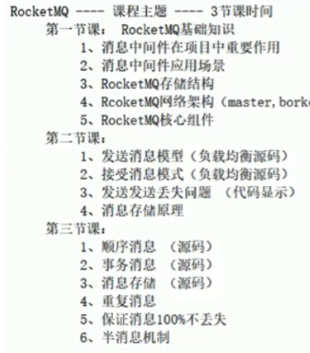
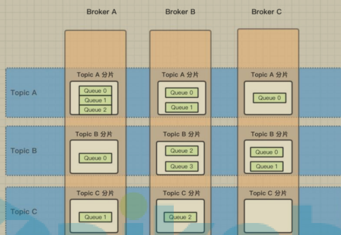
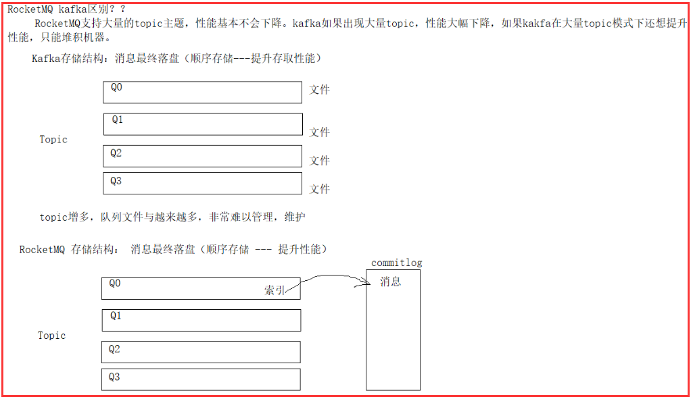
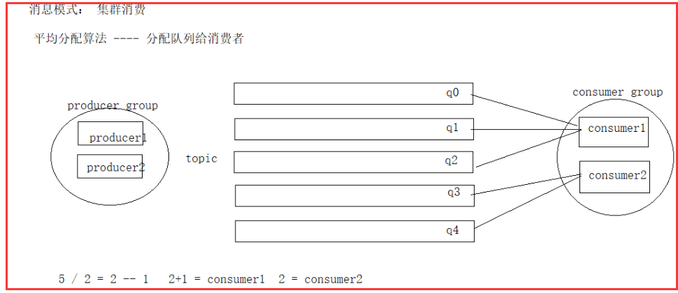
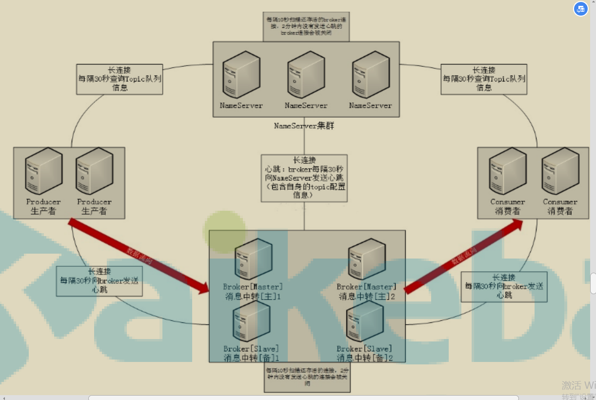

#### RocketMQ 基本理论及架构

课程主题： 
1. **为什么要学习 mq?**  --`异步解耦，流量消锋，最终消息一致性`(事务)

   > 1.解决链式调用的问题，特别是微服务后，一个客户请求可能会调用多个项目服务。为了避免同步阻塞可以`改为异步解耦的方式`,当写入mq以后，不用关心是否这条消息被消费，即可返回success。
   >
   > `使用mq一般都是写操作比较多，而读操作基本都是同步阻塞。`即使读很耗时也是要读的。
   >
   > 2.提升项目的吞吐能力，防止因为某一个环节导致服务雪崩
   >
   > 3.异步处理（提升处理速度），异步解耦（服务之间的链式调用），流量消峰（高并发提供消息堆积能力，避免直接由服务器处理）
   >
   > 4.假设项目非常小，使用mq还要部署服务器，可以使用java本身自带的blockingQueue 注：[github地址](https://github.com/pikefeier/rocketMq)

2. **mq 产品的选型?** `通过配置都可以做到消息不丢失`

   > 1.activeMq:消息堆积能力(万级)，时效性（ms）已经不能满足互联网的要求，但功能api非常完备
   >
   > 2.rabbitMq:堆积能力一般(万级)，时效性高(um)，`主从架构`
   >
   > 3.kafka:日志收集（吞吐量在几十到几百的时候会大幅度下降）只支持主要的 MQ 功能，像一些消息查询，消息回溯等功能没有提供
   >
   > 4.rocketMq:`分布式消息队列架构`堆积能力（十万级）,topic（几百-几千几乎没有影响）

3. **使用 mq 消息中间件的优缺点？** 

   优：

   | **特性**   | **ActiveMQ**                               | RabbitMQ                                                     | **RocketMQ**            | **kafka**                                        |
   | ---------- | ------------------------------------------ | ------------------------------------------------------------ | ----------------------- | ------------------------------------------------ |
   | 开发语言   | java                                       | erlang                                                       | java                    | scala                                            |
   | 单机吞吐量 | 万级                                       | 万级                                                         | 10 万级                 | 10 万级                                          |
   | 时效性     | ms 级                                      | us 级                                                        | ms 级                   | ms 级                                            |
   | 可用性     | 高(主从架构)                               | 高(主从架构)                                                 | 非常高(分布式架构)      | 非常高(分布式架构)                               |
   | 功能特性   | 成熟的产品，有较多的文档；各种协议支持较好 | 基于 erlang 开发，所以并发能力很强，性能极其好，延时很低;管理界面较丰富 | MQ 功能比较完备，扩展好 | 只支持主要的 MQ 功能，无消息查询，消息回溯等功能 |

   缺：系统可用性降低（消息队列挂了），系统复杂性增加（比如一致性问题、如何保证消息不被重复消

   费，如何保证保证消息可靠传输）

   既然有这些缺点，那么是不是不敢使用 MQ 了呢？答案很明显，不是，为了提高项目的性

   能，构建松耦合、异步的结构，必须要使用 MQ

   

4. **RocketMQ 消息的发送流程？**

   > 和kafka比较类似，是参考kafka的架构进行设计的

5. **RocketMQ 消息存储结构？** 

   

   上图可知：

   1. 消费者发送的message会在broker中的queue队列中存储（分片存储可以分担服务器的压力）
   2. 一个broker可以有多个queue
   3. 一个topic的数据可以存在于多个queue中

   > 消息是如何存储和分布的，和es的存储十分类似，将消息分片存储在多个服务器上
   >
   > 1.注册中心：服务的注册与发现（nameServer）
   >
   > 2.broker：可以理解为分布式的每台服务器

6. **日志处理为什么选中kafka？**

   1.日志写入kafka队列，然后日志处理应用`订阅`这个topic，但是kafka有个固有的缺点：当业务复杂时，`多个topic会降低性能`

   2.消息最终落盘（顺序存储--提升存取性能）kafka队列里存储的是文件（文件的写磁盘需要时间），而rocketMq队列里存储的是索引。

   也就是说每个 Topic 在 Broker 上会划分成几个逻辑队列，每个逻辑队列保存一部

   分消息数据，但是保存的消息数据实际上`不是真正的消息数据`，`而是指向 commit log 的消息索引`：这个commitLog不止只有一个(多个topic共享一个commitLog)，当一个commitLog满了以后就会生成新的

   

7. **消息是如何发送的？** 

   > 掌握流程
   >
   > rocketMq将消息的发送者规定成一个组`producerGroup`
   >
   > 消费者也是以组`customerGroup`消费主题（topic）,其中都含有负载均衡策略
   >
   > 如何保证消息的顺序性？//todo源码 同一个消息存储在同一个队列中，不同的消息存储在不同的队列中

8. **消息是如何接受的？** 

   > 掌握流程

9. **消费模式**

   > 1.广播模式
   >
   > ​	所有的消费者都要挨个消费
   >
   > 2.集群模式（消费策略：平均/环形/就近机房）
   >
   > ​	会根据负载均衡策略平均分配消息，`给consumer1分配了q0队列后，customer1不会再去消费q3(已分配给consumer2)`如果此时新增了一个consumer3，那么会进行重新分配【源码中list<Queue> 的大小对consumer进行取余】

   

10. **RocketMQ 网络架构及其分布式组件的作用？** 

    

**master1和master2是两台主机，不需要通信**

**nameServer和master集群构成了分布式架构，master和slaver构成了主从架构**(主机挂掉，从机变为主)

`nameserver`:生产者组从nameServer中获取topic的信息，通过负载均衡策略路由到对应的服务上，每一个服务都会向nameSever注册topic信息,nameserver之间相互独立。其中一台挂了，不会影响其他台。broker是向每一台nameserver进行注册topic  `//todo`：如何保证数据注册一致性？

`broker`：存储消息的服务器（主从架构），通常是集群方式存在。broker会向多个nameServer进行注册，和consumer合producer都有联系（保持长连接）

`consumer`：Consumer 与 Name Server 集群中的其中一个节点（随机选择，但不同于上一次）建立长连接，定期从 Name Server 取 Topic 路由信息，并向提供 Topic 服务的 Master、Slave 建立长连接，且定时向 Master、Slave 发送心跳

`producer`：Producer 与 Name Server 集群中的其中一个节点（随机选择，但不同于上一次）建立长连接，定期从 Name Server 取 Topic 路由信息，并向提供 Topic 服务的 Master 建立长连接，且定时向 Master 发送心跳

`topic`:`一类消息`，比如图文类型数据-->每条图文Topic 是一个上逻辑概念。消息存储不会按 Topic 分开，一条消息必须有一个 Topic

`分区的理念`：一个分区只对应一个消费者，多个分区对应多个消费者 如9中的图

`一个生产者可以提供多个topic消息，一个消费者只能消费一个topic下的消息；`如果监听多个主题（topic）可能出现消息丢失的情况

`message`:代表一条消息，使用`MessageId`唯一识别，用户在发送时可以设置 messageKey，便于之后查询和跟踪。一个 Message 必须指定 Topic，相当于寄信的地址。Message 还有一个可选的` Tag `设置，以便消费端可以基于 Tag 进行过滤消息。也可以添加额外的键值对，例如你需要一个业务 key 来查找 Broker 上的消息，方便在开发过程中诊断问题

`tag`:二级分类。标签可以被认为是对 Topic 进一步细化。一般在相同业务模块中通过引入标签来标记不同用途的消息。

`offset`:索引的存储时offset,指向的时commitlog中的位移量。下次消费就接着这个位移量继续消费

`queue`:在 RocketMQ 中，所有消息队列都是持久化，长度无限的数据结构，所谓长度无限是指队列中的每个存储单元都是定长，访问其中的存储单元使用 Offset 来访问，offset 为 java long 类型，64 位，理论上在 100 年内不会溢出，所以认为是长度无限

**面试问题：** 

1. 什么场景使用了 mq？直接调接口不行吗？ 

2. Kafka. ActiveMQ. RabbitMQ. RocketMQ 都有什么区别？ 

3. 用消息队列都有什么优点和缺点？ 

4. RocketMQ 消息是如何存储的？有什么优势？ 

   > 和kafka的对比

RocketMQ是分布式的、具有强消息堆积能力的

---